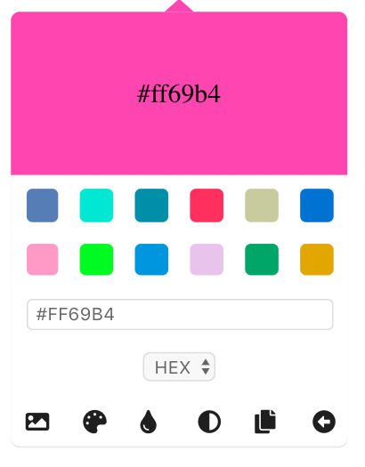
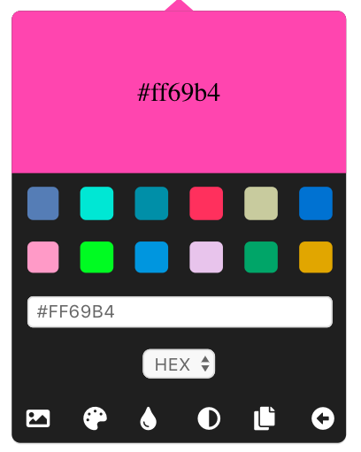
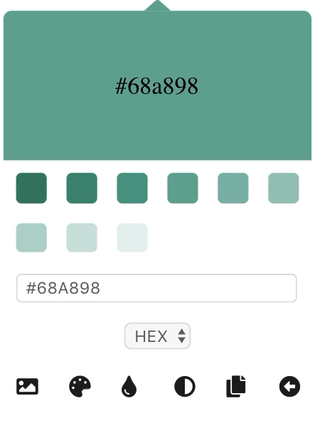
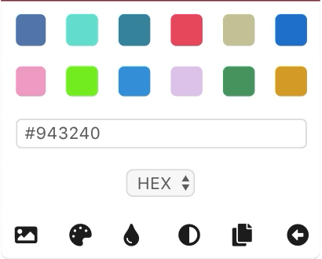
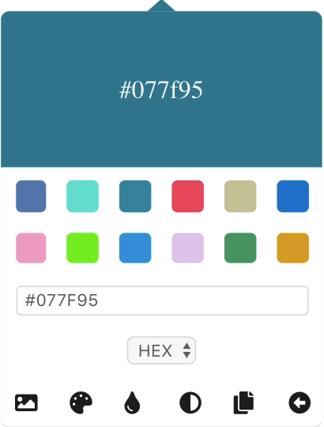
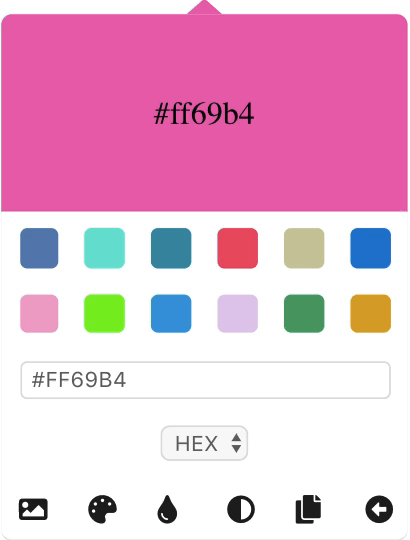

# Basic Color Picker

<p align="center">
    
</p>

## `<BasicColorPicker />`

Basic color picker includes tools such as -

- Image color extraction

- Generating shades and tints
- Built-in color manipulation tools

- and color conversion APIs

## Usage

```jsx
import React from 'react'
import { BasicColorPicker } from 'react-color-tools'

class App extends React.Component {
  state = {
    color: 'hotpink'
  }

  render() {
    return (
      <div>
        <BasicColorPicker
          color={this.state.color}
          onChange={color => this.setState({ color })}
        />
        <h1 style={{ color: this.state.color }}>React Color Tools</h1>
      </div>
    )
  }
}
```

## Component API

`color: string`

color prop represents what color is currently active in the color picker. Use this prop to initialize the color picker with a particular color, or to keep it in sync with the state of a parent component.

```jsx
<BasicColorPicker color={this.state.color} />
```

`onChange: (color: string): void => {}`

This is invoked everytime when a color is updated in the color picker for example - clicking a swatch, extracting colors from image, generating swatches, shades or tints. Use this callback to update the state of parent component with the currently active color.

```jsx
<div>
  <BasicColorPicker
    color={this.state.color}
    onChange={color => this.setState({ color })}
  />
  <h1 style={{ color: this.state.color }}>Color Tools</h1>
</div>
```

`swatches: Array<string>`

Initialize your own swatches in the color picker by passing an array of colors in either hex format or specifying the name of color.

```jsx
<BasicColorPicker swatches={['red', 'mistyrose', 'hotpink']} />
```

`onSwatchHover: (color: string): void => {}`

Similar to `onChange` callback. The only difference is, this is invoked on hovering over a color in the color picker.

`theme: string`

theme prop accepts two values - `light` and `dark`. Use this prop to set the theme of the color picker

**Light theme**

<p align="center">
    
</p>

**Dark theme**

<p align="center">
       
</p>

`maxColors: number`

This prop accepts a number for amount of colors in palette from which swatches will be generated from an image.

`showTools: boolean`

When set to true, will add advance color manipulation tools to the color picker. These tools include -

- **Color spin** - spin (change) the color by a degree amount

<p align="center">
    
</p>

- **Color desaturation** - making the color more muted or closer to gray

<p align="center">
  
</p>

- **Color saturation** - changing the intensity or purity of color

<p align="center">
    
</p>

- **Color darkening** - darken a color by an amount

<p align="center">
    
</p>

- **Color brightening** - brighten a color by an amount

<p align="center">
    
</p>

`triangle: boolean`

When set to `false`, will remove the triangle from the top of color picker

## Color conversion APIs

By default, the color format is hex. To convert a color from one format to another, use the static class methods.

For example - The default format for color when `onChange` is invoked is hex.

```jsx
state = { color: 'red' }

<BasicColorPicker color={this.state.color} onChange={color => {
  this.setState({ color });
  console.log(color); // #F00
}}/>
```

**`toRGB`**

To convert a color to rgb format, use the static method `toRGB(color)`

```
BasicColorPicker.toRGB(color)
```

Example -

```jsx
class App extends React.Component {
  state = {
    color: 'hotpink'
  }

  render() {
    return (
      <div>
        <BasicColorPicker
          color={this.state.color}
          onChange={color =>
            this.setState({ color: BasicColorPicker.toRGB(color) })
          }
        />
        <h1 style={{ color: this.state.color }}>React Color Tools</h1>
      </div>
    )
  }
}
```

Similarly for other formats,

**`toHSL`**

```
BasicColorPicker.toHSL(color)
```

**`toHSV`**

```
BasicColorPicker.toHSV(color)
```

**`toRGBPercent`**

```
BasicColorPicker.toRGBPercent(color)
```

### Image color extraction

You can also extract swatches from an image.

<p align="center">
    
</p>

### Generating shades and tints

Generate shades and tints for a color

<p align="center">
    
</p>

## Copy a color from picker

You can also directly copy the color in either format from the picker.

<p align="center">
    
</p>

## Display previous swatches

You can also go back to the previous swatches after selecting the shades and tints of a color.

<p align="center">
    
</p>

## Change color format

By default, the color format in the color picker is hex. To change the format, use the dropdown to select a color format option.

<p align="center">
    
</p>

## Generate different swatches

You can generate a different set of swatches to choose from inside the color picker

<p align="center">
    
</p>
