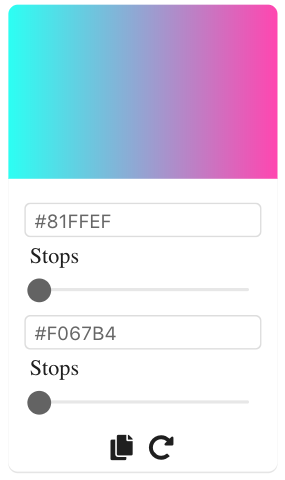
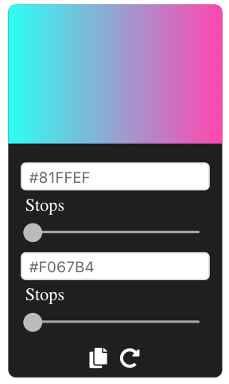
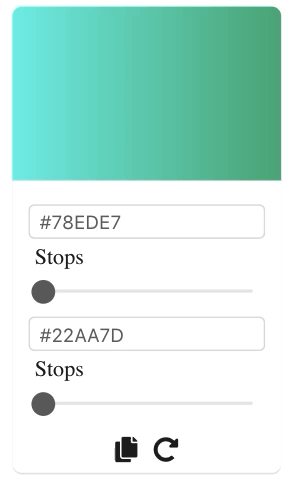

# Gradient Picker

<p align="center">
    
</p>

## `<GradientPicker />`

`<GradientPicker>` component is used to create a gradient by mixing two colors and changing their stop positions.

### Color stops

A gradient is created by changing the color stops. Color stops are stopping points in a gradient that show a specific color at the exact location you set.

## Component API

`colorOne: string`

input value for color one. It can be a color name, hex code, a rgb or rgba string, or a hsl string. The default value is `#81FFEF`.

`colorTwo: string`

input value for color two. Accepts values similar to `colorOne`.

`getGradient: (gradient: string): void => {}`

This is invoked on updating color input field and color stop positions. The callback function receives the css gradient string as its value and can be used to keep the state of parent component in sync.

```jsx
import React from 'react'
import { GradientPicker } from 'gradientPicker'

class App extends React.Component {
  state = { gradient: '' }

  render() {
    const { gradient: grad } = this.state

    return (
      <div>
        <GradientPicker getGradient={gradient => this.setState({ gradient })} />
        <h1
          style={{
            'background-image': grad,
            '-webkit-background-clip': 'text',
            '-webkit-text-fill-color': 'transparent'
          }}
        >
          React Gradient Picker
        </h1>
      </div>
    )
  }
}
```

`theme: string`

theme prop accepts two values - `light` and `dark`. Use this prop to set the theme of the color picker. The default value is `light`

**Light theme**

<p align="center">
    
</p>

**Dark theme**

<p align="center">
    
</p>

`reverse: boolean`

When set to `true`, reverses the gradient. The default value is `false`.

`mode: string`

Use this prop to specify the gradient mode. It accepts only two values - `linear` or `radial`

`direction: string`

Use this prop to specify the direction of gradient. For example - `to right` or `to left` when the gradient mode is `linear`.

```jsx
<GradientPicker getGradient={gradient => /* do some stuff with gradient */} mode='linear' direction='to left' />
```

## Picker tools

### Copy gradient string

Similar to `BasicColorPicker`, you can copy the css gradient string from the picker itself.

### Generating different gradients

You can generate different gradients and adjust their stop positions accordingly.

<p align="center">
    
</p>
