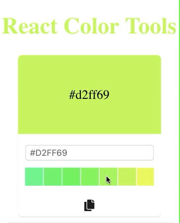

# Color Scheme Picker

    

## `<SchemePicker />`

Scheme picker component displays an array of swatches for an input color to help you choose the color based on a color scheme.

[Learn about color schemes](../README.md#theory)

## Component API

`color: string`

color prop represents what color is currently active in the color picker. Use this prop to initialize the color picker with a particular color, or to keep it in sync with the state of a parent component. The default value is `#088da5`

`onChange: (color: string): void => {}`

This is invoked everytime when a color is updated in the color picker for example - clicking a swatch or changing the color input.

`theme: string`

theme prop accepts two values - `light` and `dark`. Use this prop to set the theme of the color picker. The default value is `light`

`scheme: string`

scheme prop accepts a type of color scheme. For example - `monochromatic`. It supports the following values -

- `monochromatic`

- `analogous`

- `splitcomplement`

- `triad`

- `tetrad`
